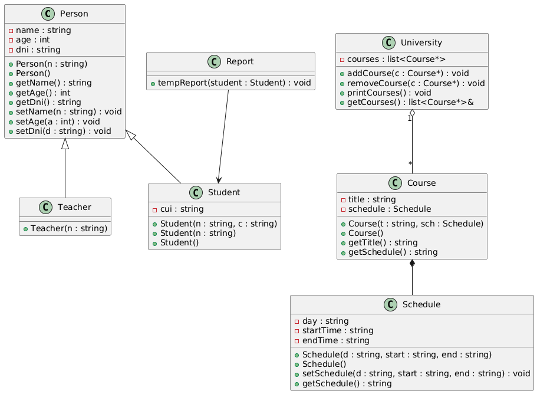

## Herencia, composicion, agregacion y dependencia en C++

Este ejercicio implementa un pequeño sistema orientado a objetos en C++ para modelar una **universidad**, incluyendo personas (profesores y estudiantes), cursos, horarios y reportes.

Características principales
- **Clases principales:**
  - `Person`: Clase base con atributos básicos (nombre, edad, DNI).
  - `Teacher`: Hereda de `Person`, representa a un profesor.
  - `Student`: Hereda de `Person`, añade un código universitario (CUI).
  - `Schedule`: Define día y rango de horas para un curso.
  - `Course`: Representa un curso con título y horario.
  - `University`: Contiene una lista de cursos, permite agregarlos y listarlos.
  - `Report`: Genera reportes básicos de estudiantes.

- **Relaciones UML:**
  - `Teacher` y `Student` heredan de `Person`.
  - `Course` contiene un `Schedule` (**composición**).
  - `University` gestiona varios `Course` (**agregación**).
  - `Report` depende de `Student` (**dependencia**).

## Diagrama UML
 <br>
El ejercicio se representa con el siguiente diagrama UML:

```plantuml
@startuml
class Person {
  - name : string
  - age : int
  - dni : string
  + getName() : string
  + getAge() : int
  + getDni() : string
  + setName(n : string) : void
  + setAge(a : int) : void
  + setDni(d : string) : void
}

class Teacher
class Student {
  - cui : string
}

class Schedule {
  - day : string
  - startTime : string
  - endTime : string
  + getSchedule() : string
}

class Course {
  - title : string
  - schedule : Schedule
  + getTitle() : string
  + getSchedule() : string
}

class University {
  - courses : list<Course*>
  + addCourse(c : Course*) : void
  + removeCourse(c : Course*) : void
  + printCourses() : void
}

class Report {
  + tempReport(student : Student) : void
}

Person <|-- Teacher
Person <|-- Student

Course *-- Schedule
University "1" o-- "*" Course
Report --> Student
@enduml
